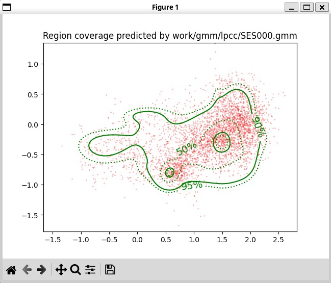

PAV - P4: reconocimiento y verificación del locutor
===================================================

Obtenga su copia del repositorio de la práctica accediendo a [Práctica 4](https://github.com/albino-pav/P4)
y pulsando sobre el botón `Fork` situado en la esquina superior derecha. A continuación, siga las
instrucciones de la [Práctica 2](https://github.com/albino-pav/P2) para crear una rama con el apellido de
los integrantes del grupo de prácticas, dar de alta al resto de integrantes como colaboradores del proyecto
y crear la copias locales del repositorio.

También debe descomprimir, en el directorio `PAV/P4`, el fichero [db_8mu.tgz](https://atenea.upc.edu/mod/resource/view.php?id=3654387?forcedownload=1)
con la base de datos oral que se utilizará en la parte experimental de la práctica.

Como entrega deberá realizar un *pull request* con el contenido de su copia del repositorio. Recuerde
que los ficheros entregados deberán estar en condiciones de ser ejecutados con sólo ejecutar:

~~~~~~~~~~~~~~~~~~~~~~~~~~~~~~~~~~~~~~~~~~~~~~~~~~~~~.sh
  make release
  run_spkid mfcc train test classerr verify verifyerr
~~~~~~~~~~~~~~~~~~~~~~~~~~~~~~~~~~~~~~~~~~~~~~~~~~~~~

Recuerde que, además de los trabajos indicados en esta parte básica, también deberá realizar un proyecto
de ampliación, del cual deberá subir una memoria explicativa a Atenea y los ficheros correspondientes al
repositorio de la práctica.

A modo de memoria de la parte básica, complete, en este mismo documento y usando el formato *markdown*, los
ejercicios indicados.

## Ejercicios.

### SPTK, Sox y los scripts de extracción de características.

- Analice el script `wav2lp.sh` y explique la misión de los distintos comandos involucrados en el *pipeline*
  principal (`sox`, `$X2X`, `$FRAME`, `$WINDOW` y `$LPC`). Explique el significado de cada una de las 
  opciones empleadas y de sus valores.

  1. `sox`: Herramienta de procesamiento de audio que convierte el archivo de entrada en un flujo de datos de audio en formato raw.

      - -t raw: Especifica el formato de salida (raw).

      - -e signed: Los datos de audio son enteros con signo.

      - -b 16: Los datos de audio tienen una profundiad de bits de 16 bits por muestra.

  2. `$X2X`: Convierte datos de audio de formato raw a formato de coma flotante.

      - +sf: Convierte datos de short (16 bits) a float.

  3. `$FRAME`: Divide la señal de audio en tramas de longitud fija. 

      - -l 240: Especifica la longitud de la trama en muestras.

      - -p 80: Determina el desplazamiento entre tramas consecutivas.

  4. `$WINDOW`: Aplica una ventana a cada frame de la señal de audio.

      - -l 240: longitud de la ventana.

      - -L 240: longiud de la ventana de salida.

  5. `$LPC`: Calcula los coeficientes LPC de cada trama de la señal de audio.

      - -l 240: Especifica la longitud de la señal de entrada.

      - -m $lpc_order: Determina el número de coeficientes LPC.

- Explique el procedimiento seguido para obtener un fichero de formato *fmatrix* a partir de los ficheros de
  salida de SPTK (líneas 49 a 55 del script `wav2lp.sh`).

    En la linea 50 y 51 se calculan el número de columnas y de filas respectivamente.

        ncol=$((lpc_order + 1)) # lpc p =>  (gain a1 a2 ... ap) 
        nrow=$(($($X2X +fa < $base.lp | wc -l) / ncol))

  `lpc_order` es el orden del análisis. `ncol` es el número de colmnas de la matriz fmatrix.
  Se suma 1 porque además de los coeficientes, se incliuye el valor de ganacia (gain a1, a2...ap).

  En el caso de las filas, `$X2X`+fa <$base.lp | wc -l cuenta el número total de valores de `$base.lp`. Diviendo por el numero de columnas `ncol` se obtiene el número de filas de la fmatrix.

      echo $nrow $ncol | $X2X +aI > $outputfile
      cat $base.lp >> $outputfile
 
 En estas dos líneas se construye el archivo fmatrix. 

  `echo $nrow $ncol | $X2X +aI > outputfile` escribe el número de filas y columnas en el archivo de salida `$outputfile`en formato ASCII.

  `cat $base.lp >>$outputfile` añade los datos LPC al archivo de salida.

  * ¿Por qué es más conveniente el formato *fmatrix* que el SPTK?

  El formato `fmatrix` es más conveniente porque: 

   -Incluye un encabezado con el número de filas y columnas, que facilita la lectura y el procesamiento de datos. 

  -Es más fácil de usar en scripts ya que proporciona una estructura clara y definida para los datos.

  -Es más compatible entre diferentes herramientas y sistemas.

- Escriba el *pipeline* principal usado para calcular los coeficientes cepstrales de predicción lineal
  (LPCC) en su fichero <code>scripts/wav2lpcc.sh</code>:

La línea de código que convierte los coeficientes LPC a coeficientes cepstrales de predicción lineal (LPCC) es la siguiente: 

    $LPC2C -m $lpc_order -M $lpc_order < $base.lp > $base.lpcc || exit 1

- Escriba el *pipeline* principal usado para calcular los coeficientes cepstrales en escala Mel (MFCC) en su
  fichero <code>scripts/wav2mfcc.sh</code>:

      sox $inputfile -t raw -e signed -b 16 - | $X2X +sf | $FRAME -l 240 -p 80 | $WINDOW -l 240 -L 240 | $MFCC -s $freq_order -l 180 -m $mfcc_order -n $mel_filter_order > $base.mfcc || exit 1

### Extracción de características.

- Inserte una imagen mostrando la dependencia entre los coeficientes 2 y 3 de las tres parametrizaciones
  para todas las señales de un locutor.
    
    
    

  + Indique **todas** las órdenes necesarias para obtener las gráficas a partir de las señales 
    parametrizadas.
    
    Código de MATLAB:
    
    
    

  + ¿Cuál de ellas le parece que contiene más información?

    - En nuestro caso, los coeficientes cepstrales de predicción lineal (LPCC).

- Usando el programa <code>pearson</code>, obtenga los coeficientes de correlación normalizada entre los
  parámetros 2 y 3 para un locutor, y rellene la tabla siguiente con los valores obtenidos.

  |                        | LP   | LPCC | MFCC |
  |------------------------|:----:|:----:|:----:|
  | &rho;x[2,3] |-0,8174      |0,2108      |-0,0225      |
  
  + Compare los resultados de <code>pearson</code> con los obtenidos gráficamente.
  
- Según la teoría, ¿qué parámetros considera adecuados para el cálculo de los coeficientes LPCC y MFCC?

  Para el cálculo de los parámetros para los coeficientes cepstrales de predicción lieanl (LPCC) son: 

  - El orden del filtro LPC.

  - Tamaño de la ventana.

  - Solapamiento de ventana.

  - Tipo de ventana.

  Para los MFCC:

  - Número de filtros Mel.

  - Número de coeficientes cepstrales.

  - Tamaño de la ventana.

  - Solapamiento de ventanas.

  - Tipo de ventana.

  - Rango de frecuencia.

### Entrenamiento y visualización de los GMM.

Complete el código necesario para entrenar modelos GMM.

- Inserte una gráfica que muestre la función de densidad de probabilidad modelada por el GMM de un locutor
  para sus dos primeros coeficientes de MFCC.

Dado que nuestros coeficientes MFC no están bien calculados, adjuntamos la gráfica de los LPCC:

- Inserte una gráfica que permita comparar los modelos y poblaciones de dos locutores distintos (la gŕafica
  de la página 20 del enunciado puede servirle de referencia del resultado deseado). Analice la capacidad
  del modelado GMM para diferenciar las señales de uno y otro.

  GMM 0 (green):

  Locutor 1:

  
  Locutor 2:

  
  
  GMM 1 (black):
  
    Locutor 1:
  
  
    Locutor 2:
  

  

### Reconocimiento del locutor.

Complete el código necesario para realizar reconociminto del locutor y optimice sus parámetros.

- Inserte una tabla con la tasa de error obtenida en el reconocimiento de los locutores de la base de datos
  SPEECON usando su mejor sistema de reconocimiento para los parámetros LP, LPCC y MFCC.

   |            Init: EM_Split            | LP   | LPCC | MFCC |
  |------------------------|:----:|:----:|:----:|
  |Error rate|   6,24%   |1,02%      |26,11%      |

     |            Init: VQ           | LP   | LPCC | MFCC |
  |------------------------|:----:|:----:|:----:|
  |Error rate|8,41%      |1,27%      |-      |

### Verificación del locutor.

Complete el código necesario para realizar verificación del locutor y optimice sus parámetros.

- Inserte una tabla con el *score* obtenido con su mejor sistema de verificación del locutor en la tarea
  de verificación de SPEECON. La tabla debe incluir el umbral óptimo, el número de falsas alarmas y de
  pérdidas, y el score obtenido usando la parametrización que mejor resultado le hubiera dado en la tarea
  de reconocimiento.

     |            Score (EM_Split)         | LP   | LPCC | MFCC |
  |------------------------|:----:|:----:|:----:|
  |THR|-3,193      |5,903      |-54,806      |
  |Missed|232      |72      |233      |
  |FalsedAlarm|4      |7      |3      |
  |CostDetection|96,4      |35,1      |95,9      |
  
  
     |            Score (VQ)          | LP   | LPCC | MFCC |
  |------------------------|:----:|:----:|:----:|
  |THR|-3,355      |5,769      |-     |
  |Missed|229      |54      |-     |
  |FalsedAlarm|5      |13      |-      |
  |CostDetection|96,1      |33,3      |-      |  
 
### Test final

- Adjunte, en el repositorio de la práctica, los ficheros `class_test.log` y `verif_test.log` 
  correspondientes a la evaluación *ciega* final.

### Trabajo de ampliación.

- Recuerde enviar a Atenea un fichero en formato zip o tgz con la memoria (en formato PDF) con el trabajo 
  realizado como ampliación, así como los ficheros `class_ampl.log` y/o `verif_ampl.log`, obtenidos como 
  resultado del mismo.
